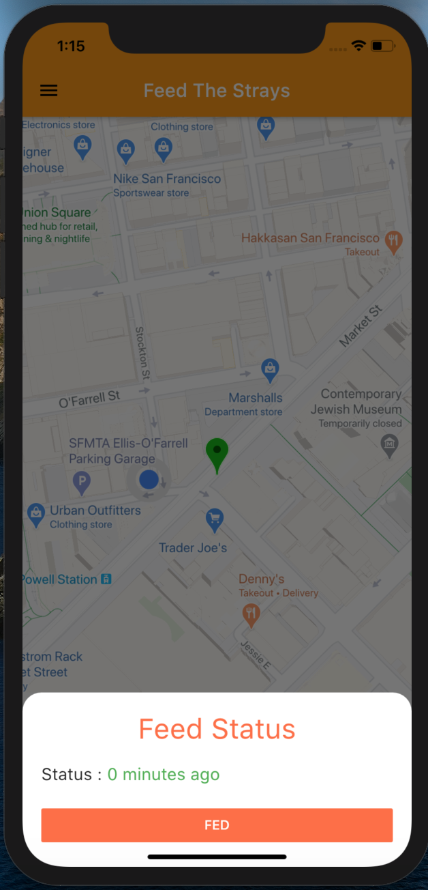
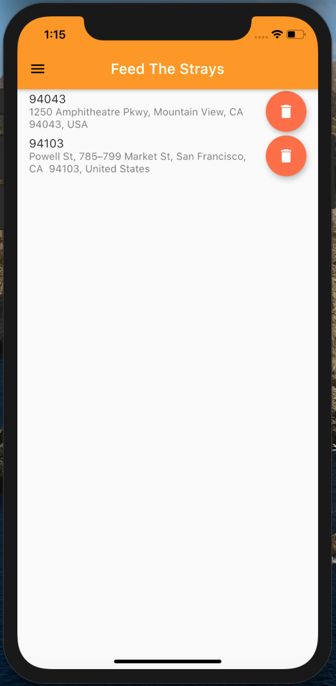

# FeedTheStrays

FeedTheStray is a Flutter application developed to tackle the hardships that are faced by the stray dogs amidst the pandameic. Most countries are in some form of lockdown, and street dogs are in deep trouble - they depend on volunteers and animal lovers to feed them. 

Thousands of stray cats and dogs in India depend on food and waste from markets, restaurants and grocery shops. But with coronavirus sending people into isolation and public establishments shutting down, strays are having a hard time finding food. 

Many who fed animals regularly stopped due to the coronavirus scare

## Usage
A user can easily signup on the application, and then mark the general location of the stray animals in his/her area. Users can see this markers on the application, and if close by can decide to feed them. 
Once fed, the users can update on the application, so as to let everyone know when was the last time the animal was fed.

## APP Apk
<a href ="https://drive.google.com/file/d/1xhgHyts8OoltMzfzuz2DMbA-DrRlwgG6/view?usp=sharing"> Link to download apk </a>

## App Quickview
### Adding a location

### Checking the feed status

### My marker list

## Contributing
Pull requests are welcome. For major changes, please open an issue first to discuss what you would like to change.

Please make sure to update tests as appropriate.

## License
[MIT](https://choosealicense.com/licenses/mit/)